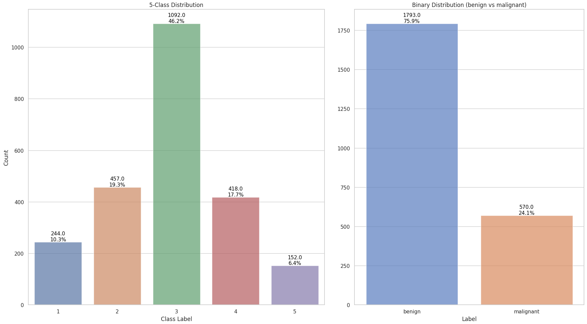
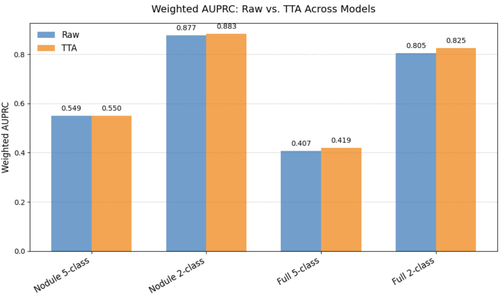
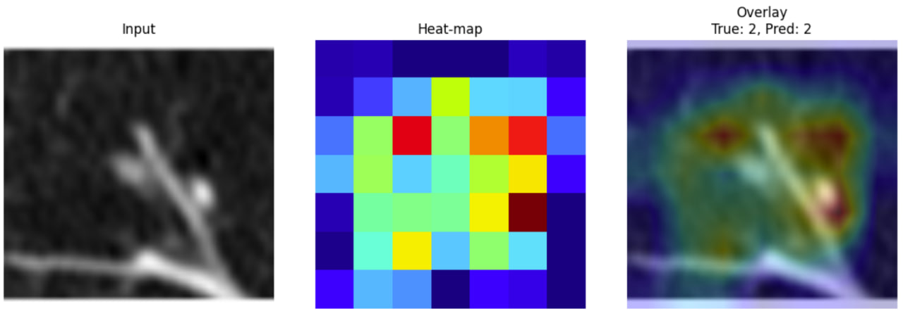
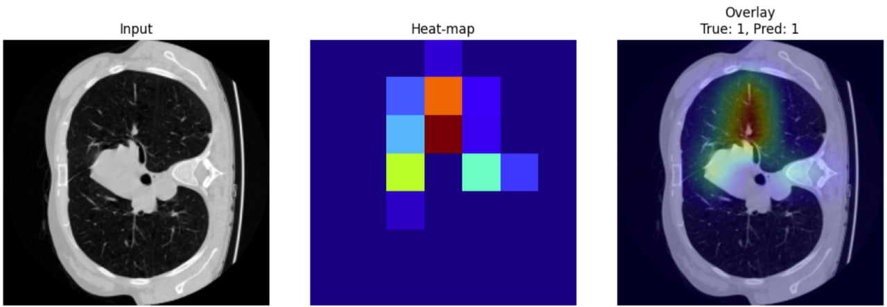

# Applied AI in Biomedicine: Lung CT Malignancy Classification

**Team M2S**  
Mehrshad Alipoor, Shahryar Namdari Ghareghani, Maurizio Tirabassi  
May, 2025

---

## Table of Contents

1. [Overview](#overview)  
2. [Data & Preprocessing](#data--preprocessing)  
3. [Modeling Approach](#modeling-approach)  
4. [Results](#results)  
5. [Interpretability](#interpretability)  
6. [Discussion & Future Work](#discussion--future-work)  

---

## Overview

This project implements four deep‐learning classifiers for lung CT images:

- **Full-Slice 5-Class (“Full5”)**: Predict a malignancy score 1–5 on entire axial slices.  
- **Full-Slice Binary (“Full2”)**: Classify full slices as benign (1–3) vs. malignant (4–5).  
- **Nodule-Crop 5-Class (“Nod5”)**: Predict a malignancy score 1–5 on zoomed-in nodule crops.  
- **Nodule-Crop Binary (“Nod2”)**: Classify nodule crops as benign vs. malignant.  

Our pipeline uses pretrained CNN backbones (ConvNeXt-Tiny selected via screening) with tailored heads, extensive data augmentations, class-balanced sampling, and hyperparameter tuning.

---

## Data & Preprocessing

1. **Dataset**  
   - 2363 full slices and corresponding nodule crops, each labeled 1–5.  
   - Severe class imbalance:
     
   - You can find all preprocessed data and trained models [here](https://www.kaggle.com/datasets/shahryarnamdari/ai-in-biomed-dataset-lung)

2. **Preprocessing Pipeline**  
   - **HU Clipping** to [–1000, 400] to focus on lung parenchyma.  
   - **Padding & Resizing**: zero-pad nodule crops to square → 224×224 bilinear resize.  
   - **Z-Score Normalization** per image (zero mean, unit variance).

Images after preprocessing and augmentation:

---

## Modeling Approach

1. **Backbone Screening**  
   - Evaluated ConvNeXt-Tiny, DenseNet121, EfficientNetB4, MobileNetV2.  
   - **ConvNeXt-Tiny** achieved highest balanced-accuracy AUC on both tasks.

2. **Class Imbalance Mitigation**  
   - Offline upsampling of minority classes via rotations (±15°), flips, zoom/crop, MixUp, CutMix.  
   - GAN-based synthesis attempted but discarded (poor sample quality).

3. **Hyperparameter Search**  
   - **Batch Size**: 16 for full slices, 32 for nodules.  
   - **Optimizer**: Adam for full; AdamW for nodules.  
   - **Classifier Head**: two-layer (256→128→n_classes) for full; single layer for nodules.  
   - **Fine-Tuning Regime**: Moderate unfreezing (50→90%) for full; Conservative (30→70%) for nodules.

---

## Results

| Model                    | Task                            | Weighted AUPRC | Accuracy          |
|--------------------------|---------------------------------|---------------:|------------------:|
| **Nod2**   | Benign vs. Malignant (nodule)   | **0.88**       | 0.82            |
| **Full2** | Benign vs. Malignant (full)    | **0.81**       | 0.78            |
| **Nod5**  | Malignancy Score 1–5 (nodule)   | 0.55           | 0.57            |
| **Full5**| Malignancy Score 1–5 (full)    | 0.41           | 0.43            |

---

## Interpretability

- **Test-Time Augmentation (TTA)** provided a marginal boost across models.
    
- **Grad-CAM++** heatmaps confirm focus on clinically relevant regions:

  - Nodule 5-class classifier  
      
  - Full-slice 5-class classifier  
      

---

## Discussion & Future Work

- **Limitations**  
  - Small, imbalanced dataset.  
  - No k-fold cross-validation or full-dataset retraining.  
- **Next Steps**  
  - Incorporate cross-validation to reduce variance.  
  - Explore larger augmentation hyperparameter grid.  
  - Retrain on combined train+val for final deployment.

